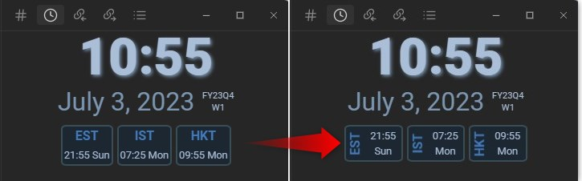

# Tokei (Japanese for "clock")

Tokei is a clock plugin for [Obsidian](https://obsidian.md).

## Alternative Style

- An alternative style is included as a snippet. You can experiment with your own snippets using the provided CSS class for all visible items.

# Manual Installation

To manually install the plugin, follow these steps:

1. Copy `main.js`, `styles.css`, and `manifest.json` to your Obsidian vault's plugin directory: `VaultFolder/.obsidian/plugins/Tokei/`.
2. Optional: Copy `Tokei - compact.css` to your snippet directory.

# Usage

1. After enabling the plugin, you won't see anything initially. To open Tokei, use the "Control/Command + P" shortcut and type "Tokei" and then select the **Tokei: Open** command.
2. Drag the Tokei icon to your preferred location.
3. Customize the settings as needed.
4. If you want to modify the layout and color schemes, take a look at `styles.css` and create your own snippet to change the colors and layout.
5. When adding timezones, press Enter after each name or offset entry.
6. Offsets are in UTC format, such as 0, +1, -5, or +5.5 (equivalent to +5:30).

Watch the video below for a visual guide:

<video src="./images/settings.mp4" controls>
  <a href="./images/settings.mp4">Watch the video</a>
</video>

# Buy Me A Coffee

If you find Tokei useful, consider supporting its development by buying me a coffee:

  

# Help and Support

I would like to express my gratitude to the members of the Discord community who have provided valuable help and support. Thank you very much!

## API Documentation

For more information about Obsidian's API, refer to the [Obsidian API Documentation](https://docs.obsidian.md/Home).

